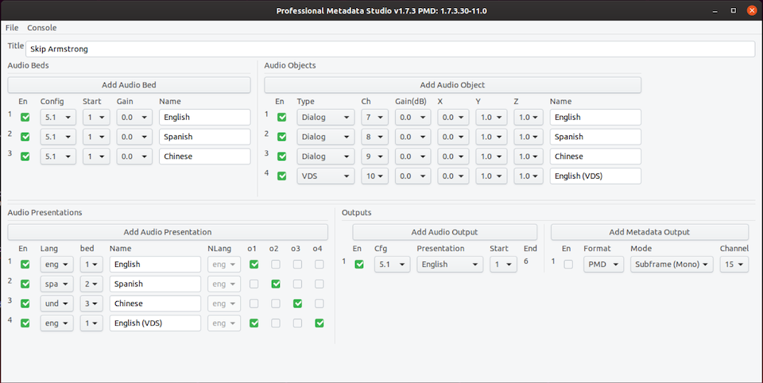

# pmd_tool (dlb_pmd_lib)
# version 2.1.1

This project provides applications and libraries to assist with conversion between
various professional audio metadata formats and containers.

pmd_tool is a command line utility that converts between the following
representations of professional audio metadata:

- ADM/Serial ADM Metadata as defined in ITU Rec. BS. 2076/2125 and SMPTE ST 2116
- PMD as defined in SMPTE RDD49 metadata

PMD Studio is an application that provides a user interface for authoring
professional audio metadata in either file or streaming formats.

For more information see the [release notes](ReleaseNotes.md).

## Getting Started

These instructions will help you get a copy of the project up and
running on your local machine for development and testing purposes.

### Folder Structure

- **README.md** This file.

- **ReleaseNotes.md** Release notes.

- **PmdStudioQsg.md** Quick Start Guide for PMD Studio.

- **LICENSE** Terms of use.

- **boost/** Boost C++ library.

- **dlb_adm/** Dolby ADM library.

- **dlb_buffer/** Buffer management component.

- **dlb_octfile/** This component defines a wrapper around the stdio
  FILE type which allows file operations to work on octets, rather than chars.
  On platforms where CHAR_BIT is >8, the top bits in each char will be zero padded.

- **dlb_pmd/** Main front-end applications and core conversion modules.

- **dlb_socket/** Cross-platform socket component.

- **dlb_st2110/** IP stream management layer

- **dlb_wave/** Component providing read/write to Microsoft (broadcast) audio WAV format.

- **dlb_xmllib/** XML parser.

- **googletest/** C++ test framework from Google.

- **Lawo/** Ember+ console integration library from Lawo.

- **libui/** Cross-platform GUI library.

- **portaudio/** Portable real-time audio library.

- **xerces/** Another XML parser used by the test framework.

- **zlib/** General purpose compression library.


### Prerequisites

For Linux and OSX, the library and tool can be built using GNU makefiles.
For Windows, Visual Studio 2015 and 2017 projects and solutions are provided.
For all platforms, 64-bit targets are supported.
For Linux, 32-bit platforms are supported.

#### Professional Sound Card

The following packages are required when building under Ubuntu/Debian and
using a professional sound card:

```
sudo apt-get install build-essential libgtk-3-dev libasound2-dev libjack-dev
```

#### NVIDIA ConnectX

When using an NVidia ConnectX SMARTNIC ethernet card the appropriate NVIDIA
ConnectX ethernet driver and Rivermax SDK must be installed. Please contact
NVIDIA regarding the Rivermax SDK and installation instructions.
In addition the following packages are required when building under
Ubuntu/Debian

```
sudo apt-get install build-essential linuxptp libgtk-3-dev python libavahi-client-dev
```

Before running the application, the linux machine must be configured to use PTP
(Precision Time Protocol). This will vary depending on the distribution used with
the insructions here being for Ubuntu.
1. Disable NTP. This is found in Settings->Details->Date&Time. Set automatic setting
of time and date to off.

2. Edit the system service unit file for ptp4l using sudo systemctl edit ptp4l using
the following or similar. Edit the ptp4l.conf file with the correct PTP settings for
your network.
```
[Service]
ExecStart=
ExecStart=/usr/sbin/ptp4l -f /etc/linuxptp/ptp4l.conf -i enp3s0f0
```

3. Repeat for the phc2sys service with the following for the unit file:
```
[Service]
ExecStart=
ExecStart=/usr/sbin/phc2sys -s enp3s0f0 -w -m -n 0
```

4. Apply the settings and restart the services:
```
sudo systemctl daemon-reload
sudo systemctl enable ptp4l phc2sys
sudo systemctl restart ptp4l phc2sys
systemctl status ptp4l phc2sys
```
Verify that the last status command shows the services running with stable clock updates.

### Build instructions

#### Using the GNU makefiles

Use the makefiles located in dlb_pmd/make. Go to the appropriate directory
and run GNU make. Release and debug executables are created in the same
directory as the makefile. When using a professional sound card supporting
the ALSA or Core Audio interfaces use the makefile in the pmd_studio
directory. When using an NVidia ConnectX SMARTNIC ethernet card, use the
makefile in the pmd_studio_rivermax directory.

#### Using Microsoft Visual Studio (on Windows)

Go to the 64 bit Windows MSVS directory under dlb_pmd/make/pmd_tool.
In Visual Studio 2015 or 2017, open the corresponding solution file (.sln).
Select build solution in MSVS.

Alternatively, run msbuild from the Windows command line:

```
>call "C:\Program Files (x86)\Microsoft Visual Studio 14.0\Common7\Tools\vsvars32.bat"
>msbuild pmd_tool_2015.sln /property:Configuration=debug
>msbuild pmd_tool_2015.sln /property:Configuration=release
```

## Running the applications

Several applications are available. However, we think the following two
are the most useful.

### PMD Tool
pmd_tool is a command line utility and detailed usage is provided by
running the tool with no options. This should be used for file conversion
operations. This application does not provide any real-time or streaming
funcionality other than writing wav files that may be streamed by another
application.

### PMD Studio
PMD Studio is an application for authoring professional metadata.
It provides a simple user interface for configuring audio beds, objects
and presentations. The authored metadata may be saved as an XML file in
either sADM or PMD formats or streamed using a professional sound card.  

Please see the [PMD Studio Quick Start Guide](PmdStudioQsg.md)

Basic usage of the command line when launching PMD Studio is obtained using '-h'.



## Testing the library

To test the basic functionality of the library, there is an additional
pmd_test tool. The build makefiles and projects are found under
dlb_pmd/make/pmd_test, and the test suite can be built in the same
manner as the pmd_tool.

pmd_test is built on top of the googletest framework, so the complete
suite can be run simply by running the executable without arguments.
Note that the tests take a long time to start up, and take several
hours to run.

pmd_fuzz is an experimental model-based fuzzer that generates random
models and tests that serialization/deserialization works correctly.

## Known Limitations

The ADM XML output does not support or use common definitions as defined
in ITU.R BS 2094.

## Release Notes

See the [Release Notes](ReleaseNotes.md) file for details, including
information on additional applications and features.

## License

This project is licensed under the BSD-3 License - see the
[LICENSE](LICENSE) file for details
